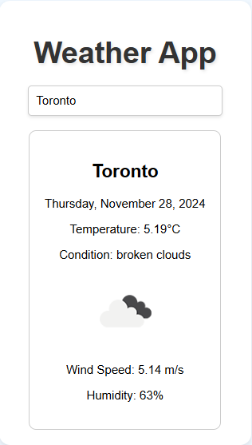
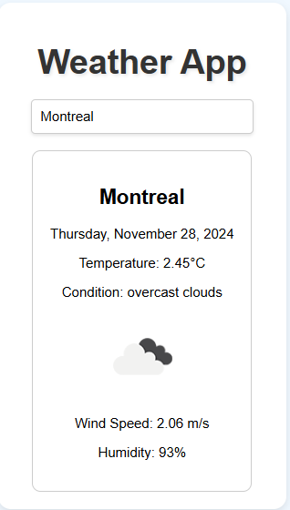
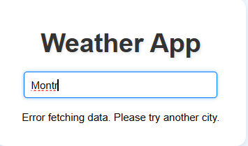

# Weather App
# 101205359_comp3123_labtest2

## Project Description
This ReactJS-based weather application allows users to search for the current weather conditions of any city. The app integrates the OpenWeatherMap API to fetch real-time weather data and displays key information such as temperature, weather conditions, wind speed, and humidity. It also dynamically updates the content based on user input.

---

## Features
1. **Weather Data Fetching**:
   - Integrates with OpenWeatherMap API to fetch real-time weather data.
   - Displays temperature, weather conditions, wind speed, and humidity.

2. **Dynamic Search**:
   - Allows users to search for weather data by city name.

3. **Icons and Styling**:
   - Uses weather icons provided by OpenWeatherMap for better visual representation.
   - Simple and user-friendly interface.

4. **React Features**:
   - State management using `useState`.
   - Lifecycle management with `useEffect`.
   - Components and props for modular and maintainable code.

## How to Run
1. Clone the repository.
2. Install dependencies: `npm install`.
3. Start the application: `npm start`.

## API Used
OpenWeatherMap API

---

## Screenshots
Below are the screenshots demonstrating the application's functionality. All screenshots are located in the `screenshots` directory.

1. **Screenshot 1**: App showing Toronto weather (default city).
   

2. **Screenshot 2**: Searching for a city and viewing updated weather data.
   

3. **Screenshot 3**: Error handling for invalid city input.
   

---
